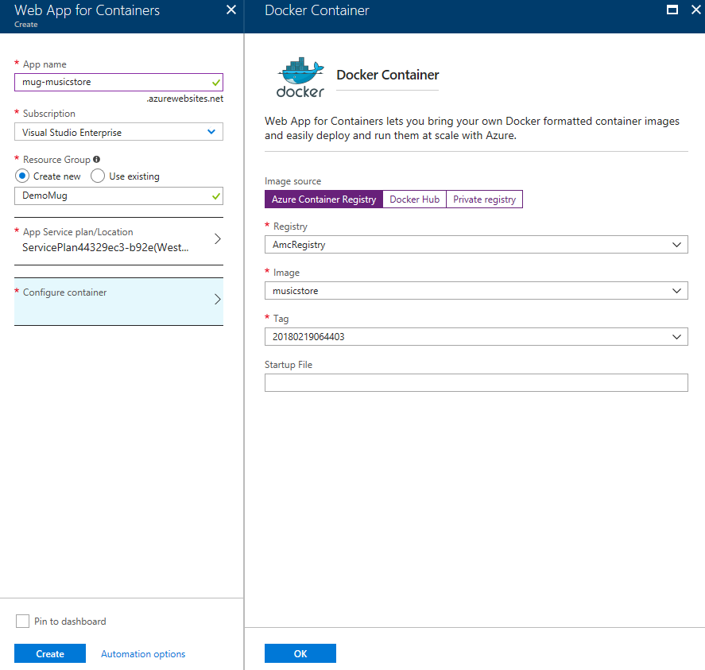

# [Lab] Déploiement d'une application ASP.NET Core avec Docker sur Azure

## Docker

### Déploiement local

Maintenant que le site est corrigé et est parfaitement fonctionnel sous IIS Express, voyons voir s'il n'est pas possible de le faire tourner sur Docker.

Prérequis :
- [Docker pour Windows](https://download.docker.com/win/stable/Docker%20for%20Windows%20Installer.exe)

Attention aux machines Windows 10 Insider build 17063+, il faudra installer cette version de Docker : https://download.docker.com/win/stable/14687/Docker%20for%20Windows%20Installer.exe
Issue sur GitHub : https://github.com/docker/for-win/issues/1458

1) Commençons ! Ajouter le support de Docker à votre projet.
Pour cela, faites un clic droit sur le projet Web, dans "Ajouter" cliquer sur "Docker Support".
Un nouveau projet **docker-compose.dcproj** est ajouté à votre solution et contient les fichiers suivants : 
- **.dockerignore**
- **docker-compose.yml**
- **docker-compose.override.yml**

Il y a également un fichier **Dockerfile** qui a été ajouté au projet web.

Lorsque vous lancez l'opération pour la première fois, cela peut durer quelques minutes le temps de récupérer tous les packages nécessaires au lancement de l'application.

2) Définir le projet **docker-compose** comme projet de démarrage puis lancer celui-ci.
Que se passe t-il ?

3) Pour gérer la connexion à SQL Server, le fichier **docker-compose.yml** doit être modifié.
L'image de SQL Server pour Windows étant relativement conséquente à télécharger, il est fortement recommandé d'utiliser les containers Linux pour ce lab ou bien de directement passer au point 4).

**Windows**

      db:
        image: "microsoft/mssql-server-windows-express"
        environment:
          SA_PASSWORD: "MugStr@sbourg"
          ACCEPT_EULA: "Y"

**Linux**

      db:
        image: "microsoft/mssql-server-linux"
        environment:
          SA_PASSWORD: "MugStr@sbourg"
          ACCEPT_EULA: "Y"

L'application MusicStore ne pourra pas démarrer tant que la base de données n'aura pas été initialisée. 
Il est ainsi nécessaire de modifier la définition de musicstore en rajoutant **depends_on** :

      musicstore:
        image: musicstore
        build:
          context: .
          dockerfile: samples\MusicStore\Dockerfile
        depends_on: 
          - db
    
Modifier la chaîne de connexion à la base de données en conséquence dans le fichier **config.json**

    "ConnectionString": "Server=db;Database=MusicStore;User=sa;Password=MugStr@asbourg;Trusted_Connection=True;MultipleActiveResultSets=true;Connect Timeout=30;"

Relancer le projet. Cela peut prendre quelques minutes le temps de récupérer l'image Docker pour SQL Server.

4) Modifier le fichier **Startup.cs** et remplacer SQL Server par SQLite.

```csharp
services.AddDbContext<MusicStoreContext>(
    options => options.UseSqlite(Configuration["Data:DefaultConnection:SqliteConnectionString"]));
```
    
5) Dans le fichier **config.json**, en dessous de la chaîne de connexion pour SQL Server, ajouter une ligne pour la connexion à la base de données SQLite :

```json
"SqliteConnectionString": "Data Source=musicStore.db"
```

6) Relancer le projet sur Docker afin de vérifier que tout est fonctionnel.

1ère étape accomplie !

### Déploiement sur Azure

Et si on publiait maintenant tout cela sur Azure ?
Il est tout à fait possible de publier cela sur un App Service Linux mais intéressons-nous plutôt à **Web Apps for Containers**.

1) Dans Visual Studio, faire un clic droit sur le projet web et choisir Publier. Choisir **Container Registry** puis **Create New Azure Container Registry** ou bien **Docker Hub** si vous disposez d'un compte.


2) Créer un nouveau **Azure Container Registry** puis publier l'image. Patienter quelques instants le temps de la publication de l'image sur Azure.


3) Depuis le portail Azure, créer une nouvelle **Web App for Containers**.


4) Configurer celle-ci en sélectionnant l'image dans l'**Azure Container Registry**, cliquer sur le bouton **OK** pour valider la sélection de l'image puis sur **Create** pour démarrer le déploiement.



Patienter quelques secondes le temps du déploiement.

5) Il est possible de suivre l'avancé du déploiement depuis les notifications. Dès que le déploiement aura été effectué, cliquer sur le bouton **Go to resource** puis sur l'URL du site.


Le site s'affiche dans le navigateur. 
